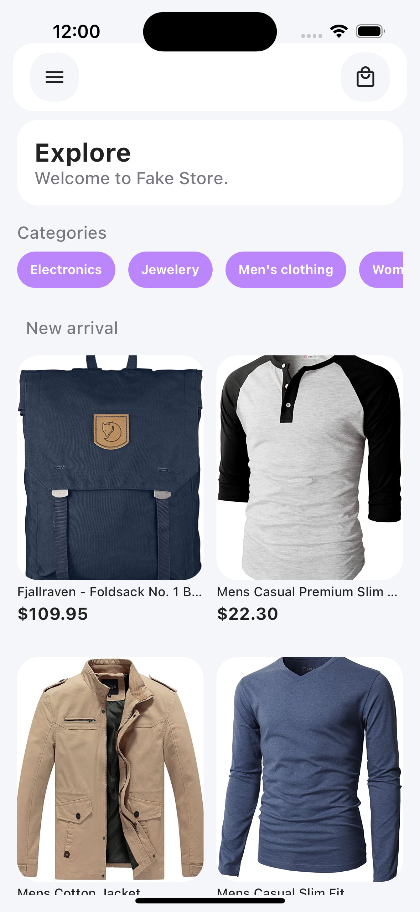
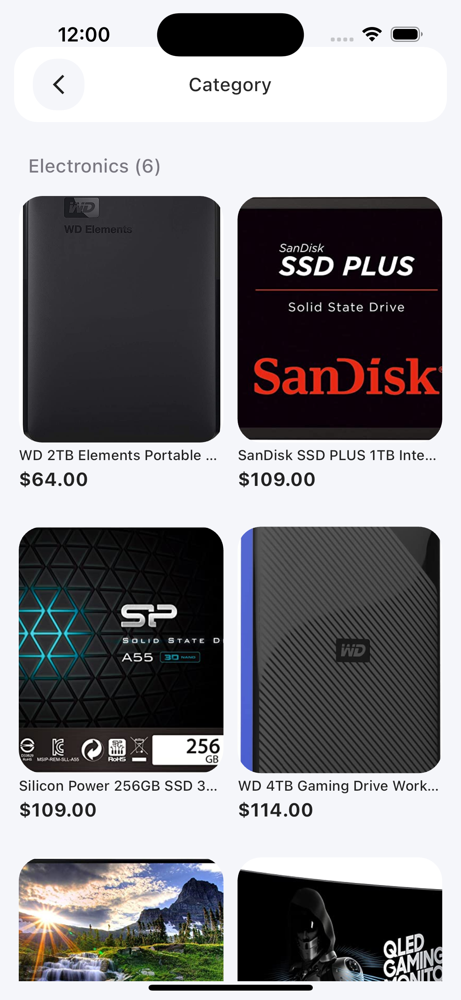

# Flutter Store App

This project is an online store application developed with Flutter. It uses the provider design pattern for state management and follows atomic design principles for organizing UI components.

## Photos



## Description

The application allows users to view product categories and a list of products on the home page. Data is handled through providers that retrieve information from RESTful services.


## Environment Setup

1. **Install Flutter**: Follow the [official instructions](https://flutter.dev/docs/get-started/install) to install Flutter on your system.

2. **Clone the Repository**:
   ```sh
   git clone https://github.com/sharfe25/phase-two-flutter.git
   cd phase-two-flutter


## VS Code Plugins

- [Flutter](https://marketplace.visualstudio.com/items?itemName=Dart-Code.flutter)
- [Awesome Flutter Snippets](https://marketplace.visualstudio.com/items?itemName=Nash.awesome-flutter-snippets)

## Installation

### Install dependencies
```
flutter pub get
```

###  Run app
```
flutter run
```